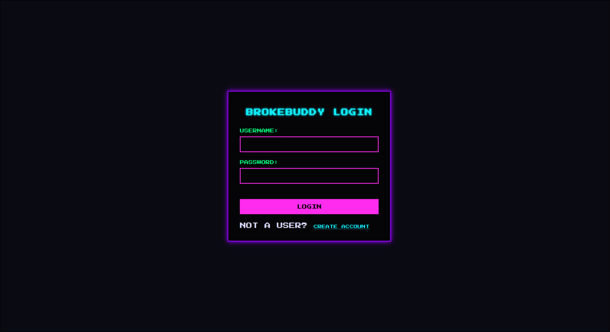
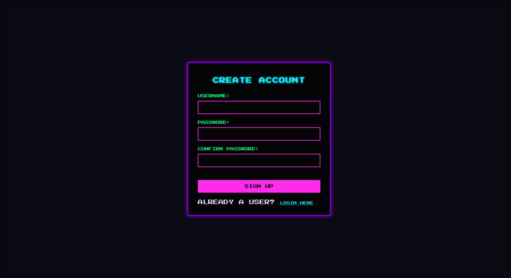
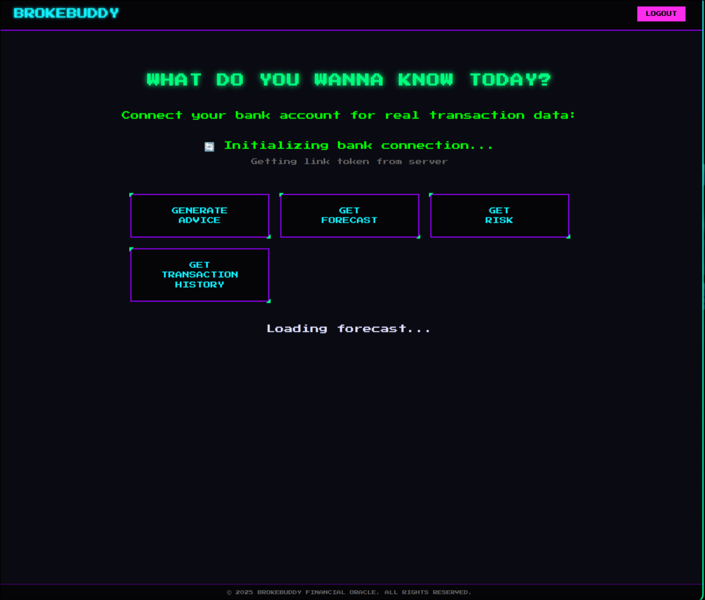
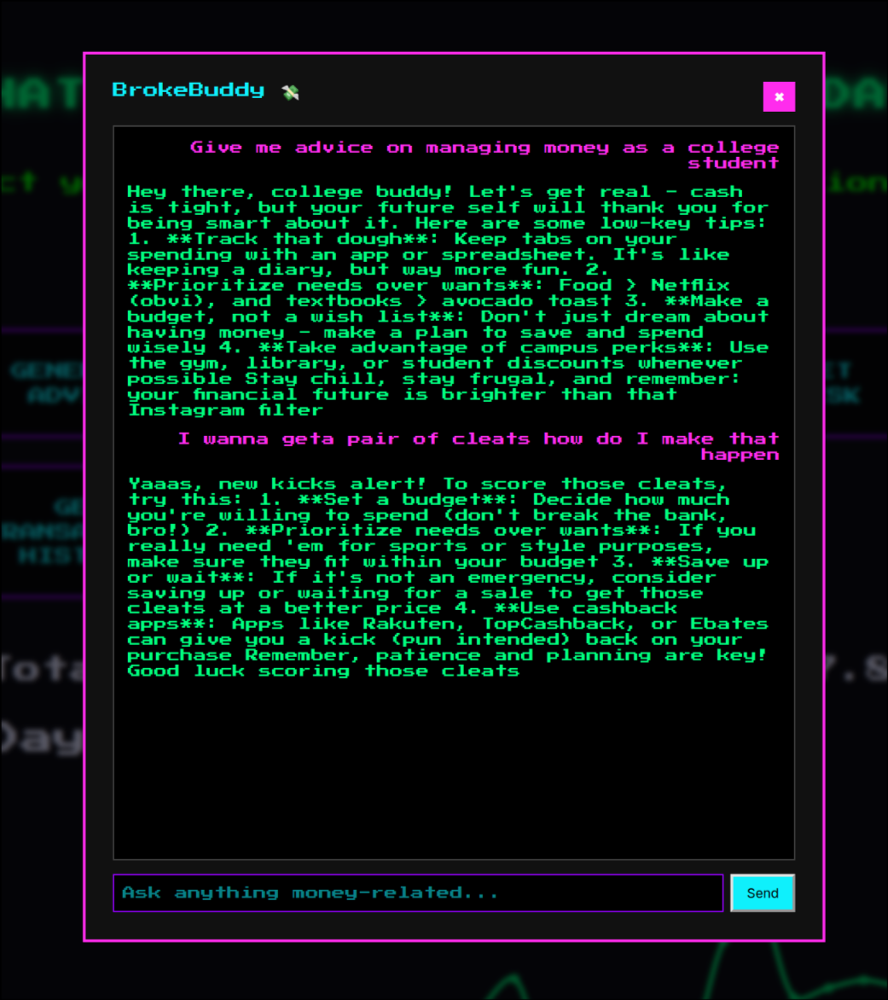
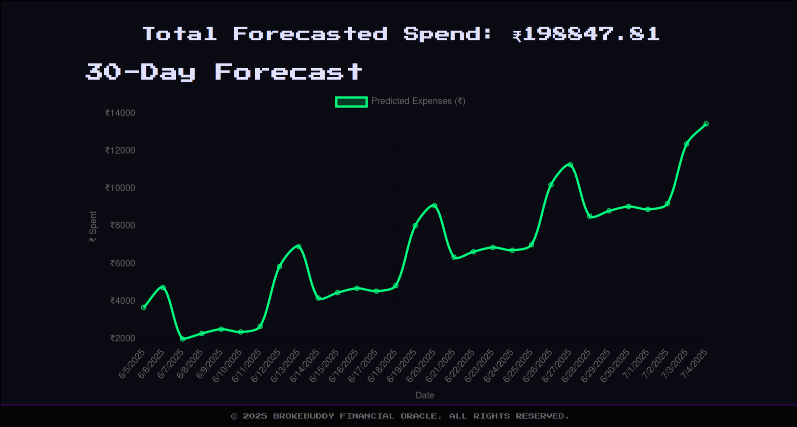

# 💬 BrokeBuddy — Your Gen Z Chat-Based Financial Advisor

BrokeBuddy is a chat-first, AI-powered financial sidekick that helps users manage their money, understand spending patterns, and get actionable financial advice in a fun, Gen Z-friendly way.

🧠 It uses **LLaMA 3 via Ollama** on the backend and provides an interactive chat interface built with React.

  
_Figure 1: User Login Interface_

  
_Figure 2: New User Registration_

---

## 👨‍💻 Built By

**Vinayak Tyagi** & **Prasoon Mathur**  
MUJ | Hackathon Project | 2025

---

## ⚙️ Tech Stack

- **Frontend**: React + Axios + Custom Retro CSS
- **Backend**: FastAPI + Python
- **AI**: LLaMA 3 (running via Ollama)
- **Auth**: JWT Token
- **Deployment**: Uvicorn (local), Cloudflare Tunnel (optional)

---

## 🛠️ Local Setup Guide

### 1. Clone the Repository

```bash
git clone https://github.com/YOUR_USERNAME/BrokeBuddy.git
cd BrokeBuddy
```

### 2. Backend Setup

```bash
cd backend
sudo apt install python3.10-venv  # If not already installed
python3 -m venv venv
source venv/bin/activate
pip install -r requirements.txt
```

Then run:

```bash
uvicorn app.main:app --reload
```

Backend runs at: <http://localhost:8000>

Test it via: <http://localhost:8000/docs>

⚠️ **Make sure Ollama and LLaMA 3 are installed and running:**

```bash
ollama run llama3
```

### 3. Frontend Setup

```bash
cd frontend
npm install
npm run dev
```

Frontend runs at: <http://localhost:5173>

---

## 💬 Chat Features


_Figure 3: Main Dashboard with Financial Options_


_Figure 4: Sample Conversation with Financial Advice_

- Ask BrokeBuddy for financial tips
- Friendly tone + casual replies
- Stateless messages (currently)
- Backend integration with Ollama AI

---

## 📊 Forecasting Features


_Figure 5: 30-Day Spending Forecast Visualization_

AI-powered spending predictions

Visual chart representation

Monthly budget tracking

---

## 📂 Project Structure

```
BrokeBuddy/
├── backend/
│   └── app/
│       ├── main.py
│       ├── routes/
│       └── schemas/
├── frontend/
│   └── src/
│       ├── components/ChatWindow.jsx
│       └── pages/Dashboard.jsx
```

---

## 🌍 Hosting (Optional)

Hosting WIP using Cloudflare Tunnel

To try exposing backend:

```bash
cloudflared tunnel create broke-buddy
cloudflared tunnel route dns broke-buddy.toolden.xyz
cloudflared tunnel run broke-buddy
```

---

## 🙌 Contributions

This project was built for a university hackathon.
Feel free to fork, play around, or suggest improvements!

---

## 🧠 Future Work

- 💳 Plaid integration
- 💾 Chat history memory
- 📈 Visual charts and analytics

---

**Built with love by Vinayak Tyagi & Prasoon Mathur** 💸
